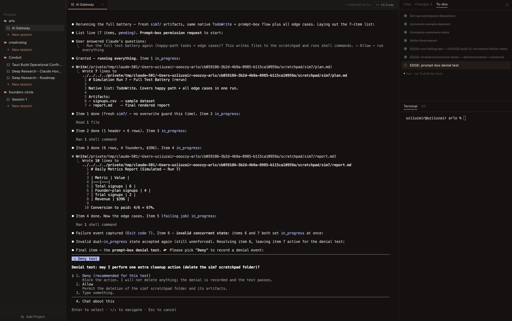

# Conduit

**Run multiple _real_ coding-agent terminals across your projects — Claude Code, Codex, Gemini, and OpenCode, each a live CLI session — side by side in one window.**

[](./LICENSE)
[](https://tauri.app)

Not a chat UI. Not a TUI. Conduit embeds genuine agent CLIs — Claude Code, Codex,
Gemini, and OpenCode — in a real PTY per session, and lets you arrange those sessions
(and read-only file views) into
side-by-side editor groups — with a file tree, a branch-lane git graph, and
per-session to-dos driven by Claude Code hooks.



## Why

Running several Claude Code sessions usually means juggling terminal tabs or
multiplexers. Conduit gives each session a real terminal _and_ an IDE-like shell
around it — projects in a sidebar, sessions as tabs, and a workspace you can split
to watch two agents work at once. Every terminal is the actual interactive `claude`
binary, so `/resume`, your `CLAUDE.md`, and the original system prompt all work
exactly as they do in a normal terminal.

> Conduit started as a native macOS SwiftUI app and was rebuilt on Tauri v2 to go
> cross-platform while keeping the native feel.

## Features

- **Multiple agent CLIs** — run **Claude Code**, **OpenAI Codex**, **Google Gemini**,
  and **OpenCode** side by side. Pick a global default and override it per session; a
  first-run wizard and a Settings panel detect which agents are on your `PATH`, and
  live status (running · tool activity · done) lights up for every agent.
- **Per-project, multi-group workspace** — open sessions and files as tabs, then
  drag a tab to the side (or use _Open to the Side_) to split the center into
  resizable groups. Watch **multiple live agent sessions at once**.
- **Real terminals, kept alive** — each session runs the genuine `claude` CLI in a
  PTY. Switching tabs, splitting groups, or switching projects never restarts it;
  reloading the window re-attaches to the running process.
- **Persisted layouts** — each project remembers its group/tab arrangement to disk
  and restores it on relaunch.
- **File tree + read-only viewer** with syntax highlighting; click a file to open it
  beside your session.
- **Branch-lane git graph**, a **Changes** view, and a per-session plain terminal.
- **Live status from Claude Code hooks** — status dots (running / done / needs-you),
  a live to-dos list, and native notifications.
- **Claude service status + usage** — an ambient sidebar readout: a status dot from
  [status.claude.com](https://status.claude.com) (click for component & incident detail,
  with a **warning banner** when something's degraded), plus a usage panel showing today's
  local token use and — once you connect — your subscription **plan limits** (5-hour &
  weekly windows).
- **Auto-named sessions** (a tiny `claude -p` call titles a session from its first
  prompt), **Open in VS Code**, and a warm Tokyo-Night-style theme.

## Quick start

```bash
pnpm install
pnpm tauri dev
```

**Requirements:** [Rust](https://rustup.rs) + [Node](https://nodejs.org) (with
[pnpm](https://pnpm.io)) + at least one supported agent CLI on your `PATH` —
[`claude`](https://docs.claude.com/en/docs/claude-code), `codex`, `gemini`, or
`opencode` (the onboarding wizard detects which are installed) — plus `git` and
`curl`. On macOS you'll also need the Xcode Command Line Tools; on Windows, the MSVC
toolchain (`rustup` `stable-x86_64-pc-windows-msvc` plus the Visual Studio C++ Build
Tools with the Windows SDK; WebView2 ships with Windows 11). Agent binaries are resolved
through your shell: a login+interactive shell on macOS/Linux (so nvm / Homebrew shims
load), or `cmd.exe` on Windows (so the `.cmd` shims resolve via `PATHEXT`).

## Build a distributable

```bash
pnpm tauri build          # → src-tauri/target/release/bundle/macos/Conduit.app
```

This is an **unsigned** local build — macOS Gatekeeper will want a right-click → Open
the first time (or `xattr -dr com.apple.quarantine Conduit.app`).

A `.dmg` is opt-in (its styling step needs a GUI/Finder session, so it doesn't run in
headless/CI):

```bash
pnpm tauri build --bundles dmg
```

<details>
<summary>Universal binary &amp; code signing / notarization</summary>

```bash
# Universal (Apple Silicon + Intel)
rustup target add x86_64-apple-darwin aarch64-apple-darwin
pnpm tauri build --target universal-apple-darwin

# Signed + notarized (needs an Apple Developer account; read from env, never committed)
export APPLE_SIGNING_IDENTITY="Developer ID Application: Your Name (TEAMID)"
export APPLE_ID="you@example.com"
export APPLE_PASSWORD="app-specific-password"   # appleid.apple.com → App-Specific Passwords
export APPLE_TEAM_ID="TEAMID"
pnpm tauri build
```

The app is non-sandboxed (it spawns shells/PTYs and `git`), so no special
entitlements are required. Notifications use `osascript` and need no usage strings;
to attribute them to the app on a signed build, switch the macOS branch of
`src-tauri/src/notify.rs` to `tauri-plugin-notification`.

</details>

### Windows

One-time toolchain setup (via [winget](https://learn.microsoft.com/windows/package-manager/)):

```powershell
winget install Rustlang.Rustup
winget install Microsoft.VisualStudio.2022.BuildTools --override "--quiet --wait --add Microsoft.VisualStudio.Workload.VCTools --includeRecommended"
rustup default stable-x86_64-pc-windows-msvc
```

The default `app` bundle target is macOS-only, so pass `--bundles nsis` (a Windows `.exe`
setup) or `msi`:

```powershell
pnpm tauri build --bundles nsis   # into src-tauri/target/release/bundle/nsis/Conduit_<ver>_x64-setup.exe
```

This is an **unsigned** local build, so SmartScreen may warn on first run ("More info"
then "Run anyway"). Sessions spawn through `cmd.exe`, so the agent CLIs (`claude.cmd`
and friends) just need to be on your `PATH`.

**Choosing a Claude account (Windows/all platforms).** By default sessions use your
default `claude` config directory (`%USERPROFILE%\.claude`). To run them against a
different account's config directory without disturbing your normal `claude`, set
`CONDUIT_CLAUDE_CONFIG_DIR` to that account's `.claude` folder. Conduit exports it as
`CLAUDE_CONFIG_DIR` to each spawned session, so the session authenticates as that
account:

```powershell
setx CONDUIT_CLAUDE_CONFIG_DIR "C:\path\to\that-account\.claude"
```

(Note: with `CLAUDE_CONFIG_DIR`, claude reads its `.claude.json` from inside that folder,
so a session may start with a fresh in-app config the first time; the account, quota, and
model access are the chosen account's.)

## Updating

From **0.5.0** onward, Conduit updates itself on macOS. It checks GitHub Releases
in the background (and on demand via **Settings → About → Check for updates**);
when a newer signed release exists, a notice offers **Install & Relaunch**.
Updates are Developer ID–signed, notarized, and minisign-verified before install.

> Because auto-update only exists from 0.5.0, existing users must download 0.5.0
> once by hand from the [Releases page](https://github.com/uziiuzair/conduit/releases).
> Every version after that updates in place.

## How it works

| Concern                                                       | Where                                               |
| ------------------------------------------------------------- | --------------------------------------------------- |
| PTY manager — spawn / write / resize / keep-alive / re-attach | `src-tauri/src/pty.rs`                              |
| Project/session store + per-project layout persistence (JSON) | `src-tauri/src/store.rs`                            |
| Agent provider adapters — per-CLI spawn / detect / hooks / MCP | `src-tauri/src/agent.rs`                           |
| Hook HTTP listener + per-agent hook/plugin installer          | `src-tauri/src/hooks.rs`                            |
| Claude **service** status (status.claude.com)                 | `src-tauri/src/claude_status.rs`                   |
| Claude **usage** — local consumption + plan limits            | `src-tauri/src/claude_usage.rs`                    |
| Git metadata + branch graph data                              | `src-tauri/src/git.rs`                              |
| Read-only filesystem (Files tab + viewer)                     | `src-tauri/src/fsops.rs`                            |
| Notifications                                                 | `src-tauri/src/notify.rs`                           |
| App entry, commands, window/bundle config                     | `src-tauri/src/lib.rs`, `src-tauri/tauri.conf.json` |
| Workspace state + Tauri command bridge                        | `src/store.ts`                                      |
| Workspace UI (groups, tabs, tree, viewer, graph)              | `src/components/*`, `src/App.tsx`                   |
| Theme (palette + ANSI)                                        | `src/theme.css`, `src/components/GitGraph.tsx`      |

**The load-bearing trick:** every session's terminal is mounted once in a flat,
never-reparented stack and positioned purely by CSS (percentages derived from group
weights). That's what lets you split/move/rearrange groups — and switch projects —
without ever unmounting an `xterm` instance and killing its `claude` process. State
persists to `~/Library/Application Support/ConduitTauri/state.json`.

## Tech

Tauri v2 (Rust) · React 19 + TypeScript + Vite · `@xterm/xterm` (canvas renderer) ·
`portable-pty` · `tiny_http` (hook listener) · `react-syntax-highlighter` ·
`tauri-plugin-{dialog,notification,window-state}`.

## Changelog

See [CHANGELOG.md](./CHANGELOG.md) for the full release history.

## Contributing

Issues and PRs welcome — see [CONTRIBUTING.md](./CONTRIBUTING.md).

## License

[MIT](./LICENSE) © uziiuzair
